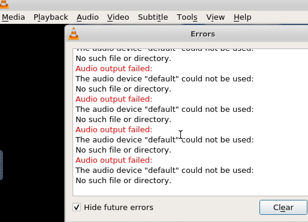
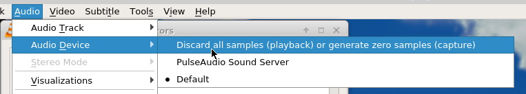
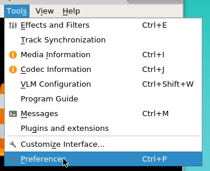
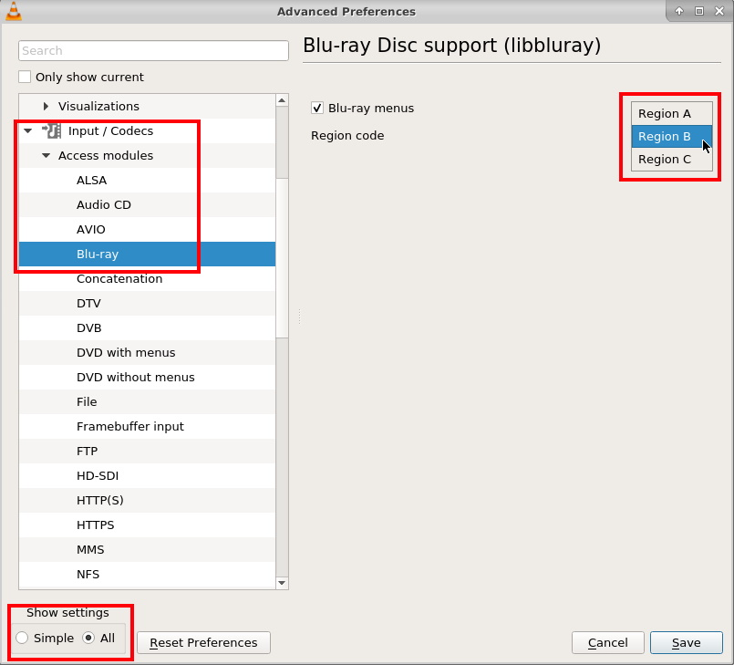

# docker-media-novnc

A noVNC docker with bunch of useful tool for video mediabased on [accetto/xubuntu-vnc-novnc:lab](https://github.com/accetto/xubuntu-vnc-novnc/tree/master/docker/xubuntu-vnc-novnc).

## Embedded tools

- `vlc` : [VLC](https://www.videolan.org/vlc/).
  - `libdvd-pkg` : [DVD-Video playing library](https://packages.ubuntu.com/focal/libdvd-pkg)
  - `libbluray-bdj` : [Blu-ray Disc Java support library](https://packages.ubuntu.com/focal/libbluray-bdj)
- `mkvtoolnix-gui` : [mkvtoolnix](https://mkvtoolnix.download/).
- `mediainfo-gui` : [mediainfo](https://mediaarea.net/en/MediaInfo).
- `audacity` : [Audacity](https://www.audacityteam.org/).
- `subtitleeditor` : [Subtitle Editor](https://github.com/kitone/subtitleeditor).
- `ffmpeg` : [ffmpeg](https://ffmpeg.org/).

## Limitations

- No audio are available :mute:
- `Subtitle Editor` can't open Blu-Ray Subttiltle file (`.sub`). And `Subtitle Edit` don't work smoothly on linux with wine (from my last test, if you know the good way to run, open a issues).

## Usage

Start the container. The container will be deleted after the exit.
```shell
docker run -it --rm \
  --name=media-novnc \
  --user 1000:1000 \
  -e TZ=Europe/London \
  -e VNC_PW=<vnc password> `#optional` \
  -p 5901:5901 \
  -p 6901:6901 \
  -v <path to data>:/data \
  hummingbirdy2/media-novnc
```

## Parameters

| Parameter | Function |
| :----: | --- |
| `--user 1000:1000` | Change the default user. Only numerical UserID and GroupID are supported - see below for explanation (`1001:1001` by default) |
| `-e TZ=Europe/London` | Specify a timezone to use EG Europe/London. [Time Zone list](https://en.wikipedia.org/wiki/List_of_tz_database_time_zones) |
| `-e VNC_PW=<vnc password>` | Specify a vnc password (`headless` by default) |
| `-p 5901` | VNC TCP port |
| `-p 6901` | noVNC TCP port |
| `-v <path to data>` | Path to your data |

### User / Group Identifiers

When using volumes (`-v` flags) permissions issues can arise between the host OS and the container, we avoid this issue by allowing you to specify the user `PUID` and group `PGID`.

Ensure any volume directories on the host are owned by the same user you specify and any permissions issues will vanish like magic.

In this instance `PUID=1000` and `PGID=1000`, to find yours use `id user` as below:

```shell
  $ id username
    uid=1000(dockeruser) gid=1000(dockergroup) groups=1000(dockergroup)
```

## Known Issues

### VLC error: "Audio output failed"

At the start of a video, VLC will spam you this error:



To avoid it, disable all audio device: **Audio** > **Audio Device** > **Discard all samples...**



## TODO

- [ ] Found a way to disable Audio Device on VLC by default
- [ ] Add installed app to the desktop for lazy people like me

## How To...

### Change Blu-Ray Region Code on VLC

To select the Blu-Ray Region Code, open **Tools** > **Preferences**



Show all settings, after **Input / Codecs** > **Access modules** > **Blu-ray** > **Region code** > **Save**


